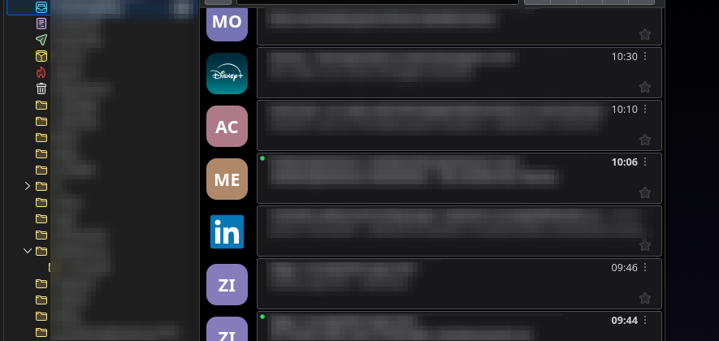

# Thundericon

Minimalist **sender avatars** for the Thunderbird message list. A circular badge
with the sender's initials — or the sender's **Gravatar photo** / the brand's
**verified BIMI logo** when available — is injected into every row of the thread
tree, in both **Table** and **Cards** layouts, without blocking the main thread.




## Features

- **Non-blocking injection.** A single `MutationObserver` watches the virtualized
  thread tbody; mutations are coalesced and processed in **idle, time-sliced
  batches**. Rows are recycled as you scroll, so each row's last sender is cached
  and unchanged rows are skipped — decoration is idempotent.
- **Both list layouts.** Compact inline badge in Table view; larger left-floated
  badge in Cards view.
- **Stronger unread indicator (Cards view).** Makes new/unread mail pop far more
  than Thunderbird's default bold — an Outlook/eM Client-style accent bar on the
  leading edge of unread cards and/or fading read messages' avatars, in a color
  you choose. Especially helpful in dark mode. On by default; pick the style
  (bar + fade / bar / ring / fade) in Options. Applies to the Cards layout only.
- **Auto-expand attachments.** Optionally expand the attachment list in the
  message header automatically, so a message's attachments are visible without
  clicking the twisty to expand — in the preview pane, a message tab or a
  standalone message window. On by default; toggle it in Options → Attachments.
- **Configurable color logic:** muted neutral palette (default), grayscale, soft
  low-saturation hue, vibrant HSL hash, a single fixed color, or your own custom
  palette. Per-sender colors are stable across sessions (deterministic hash).
- **Domain → color overrides.** Pin a color for everyone at `example.com`.
- **Verified brand logos (BIMI), opt-in.** When a sender's domain publishes a
  BIMI logo **and** the message passes DMARC, the brand's logo replaces the
  initials; everyone else keeps initials. Lookups run purely over DNS-over-HTTPS
  (Cloudflare, Quad9, Mullvad, AdGuard family/standard, Cisco Umbrella/OpenDNS,
  Google, or a custom RFC 8484 endpoint), with results — *including "no logo"* —
  cached per domain and persisted across restarts. Optional "base-domain only"
  lookup (so `mail2.disneyplus.com` resolves `disneyplus.com`) and per-folder
  skips (Sent, Drafts, Junk, …).
- **Gravatar profile photos, opt-in.** When a sender has a [Gravatar](https://gravatar.com)
  photo for their address, it replaces the initials — and **takes precedence over
  a BIMI logo** if both exist. A lookup sends a hash of the sender's address to
  gravatar.com, so it is **off by default**. Results — *including "no photo"* — are
  cached per address and persisted, with a long default refresh (1 week, since
  Gravatars change rarely) and the same per-folder skips. A built-in **Test
  Gravatar…** tool shows the hash, URL and a step-by-step log.
- **Typography & geometry.** Font family, weight, uppercase, initials length
  (1–2) and source (display name / email), badge size, and corner radius
  (0–50%, where 50% = circle).
- All preferences live in `browser.storage.local`; the open list updates **live**,
  no restart required.

## Architecture

| File | Role |
| --- | --- |
| `manifest.json` | MV3, registers the experiment, background, and options. |
| `api/threadpane/` | Privileged **Experiment API** — the only way to reach `about:3pane` / `about:message`. Injects the renderer + CSS, relays config, resolves BIMI logos (DoH + DMARC + SVG fetch) and Gravatar photos (MD5 + image fetch) with caching, auto-expands the message reader's attachment list, and tears down cleanly. |
| `injected/avatar-renderer.js` | Runs inside `about:3pane`: observer, idle batching, recycle-aware decoration, per-message BIMI/Gravatar requests (Gravatar > BIMI > initials). |
| `injected/avatars.css` | Badge styling, driven entirely by CSS custom properties. |
| `src/avatar-core.js` | Shared, pure logic: initials + color (used by renderer **and** options preview). |
| `src/bimi-core.js` | Shared, pure BIMI logic: record parsing, DMARC-pass check, base-domain reduction, DNS-wireformat encode/decode. |
| `src/gravatar-core.js` | Shared, pure Gravatar logic: email normalization, MD5, avatar URL, standard base64. |
| `src/config.js` | Defaults + `storage.local` load/save/subscribe. |
| `background.js` | Loads config, starts the experiment, relays changes. |
| `options/` | Configuration UI with a live preview. |

> The message list lives in the privileged `about:3pane` document, which ordinary
> WebExtension content scripts cannot touch — hence the small experiment bridge.
> It uses internal globals (`gDBView`, thread-tree DOM) that are not stable
> WebExtension API, so the add-on declares a Thunderbird version range
> (`strict_min_version` 128.0; `strict_max_version` is set to the current release
> at build time) and falls back to scraping the correspondent cell if the DB view
> is unavailable.

## Build

One command validates the manifest, generates icons if missing, and produces an
installable archive:

```sh
./build.sh            # -> dist/thundericon-<version>.xpi
./build.sh --test     # run the test suite first
./build.sh --clean    # wipe dist/ before building
./build.sh --icons    # force-regenerate the PNG icons
```

`build.sh` aborts (non-zero) if the manifest is invalid or references a missing
file, so it never emits a broken add-on. Lower-level helpers remain available:
`python3 tools/package.py` (validate + zip) and `python3 tools/make-icons.py`.

Tagged releases are built and attached to GitHub Releases automatically (version
and `strict_max_version` are injected at build time) — see [`RELEASE.md`](RELEASE.md).

## Install

> [!IMPORTANT]
> Thundericon is an **experiment** add-on (it needs privileged access to the
> message list). **Release Thunderbird disables any unsigned add-on installed
> permanently** — so installing the `.xpi` via *Add-ons and Themes* leaves it
> **disabled**: grayed-out Options button, no options dialog, no avatars. Use the
> temporary-load method below, which runs unsigned add-ons fine.

- **Temporary load (use this for development).** Thunderbird → **Tools → Developer
  Tools → Debug Add-ons** (`about:debugging`) → **This Thunderbird** → **Load
  Temporary Add-on…** → pick **`manifest.json`** (not the `.xpi`). Grant the single
  "full, unrestricted access" permission. It loads **enabled**, so the Options
  button works immediately. Cleared on restart; re-pick `manifest.json` to reload
  (also hot-reloads edits — no rebuild needed).
- **Permanent install** requires signing — there is no way around it on release
  Thunderbird:
  - submit the `.xpi` to [addons.thunderbird.net](https://addons.thunderbird.net)
    for (self-)distribution signing, **or**
  - run Thunderbird **Beta/Daily/Developer** and set
    `xpinstall.signatures.required = false` in the Config Editor, then
    Add-ons Manager → gear ⚙ → **Install Add-on From File…** → `dist/*.xpi`.

If a temporary load still shows a grayed Options button, check that
`extensions.experiments.enabled` is `true` in the Config Editor.

## Tests

```sh
npm ci        # dev-only: jsdom for the renderer harness
npm test      # node --test  (61 tests)
```

- `test/avatar-core.test.js` — pure logic: parsing, initials, all color modes,
  domain overrides, contrast, hex normalization.
- `test/bimi-core.test.js` — BIMI record parsing, the DMARC-pass check,
  base-domain reduction, and DNS-wireformat encode/decode/base64url.
- `test/gravatar-core.test.js` — MD5 (known vectors + Node-crypto cross-check),
  email normalization, the documented Gravatar hash example, avatar URL, base64.
- `test/config.test.js` — defaults, `storage.local` round-trip + merge, change
  subscription (storage mocked).
- `test/renderer.test.js` — drives `avatar-renderer.js` against a **jsdom**
  `about:3pane`: badge rendering, **no duplicates**, **virtualized-row recycling**,
  idempotency, layout toggles, BIMI/Gravatar image swap-in, **Gravatar-over-BIMI
  precedence**, the DMARC gate, folder skipping, the `gDBView` scraping fallback,
  **unread-emphasis marker classes (Cards only) + live read/unread flip**,
  enable/disable, and clean `destroy()`.

> These cover the pure modules and ~the whole renderer. The privileged experiment
> bridge (`api/threadpane/`) and true end-to-end still require a live Thunderbird
> (the manual steps below).

## Verify (in Thunderbird)

- Open a folder → badges appear on every row (Table view). Switch the list header
  to **Cards** view → larger left-aligned badges.
- Scroll a large folder fast → no jank, no duplicate/stale badges.
- **Options** → change color mode / font / size / radius, add a `domain → color`
  mapping → the open list updates without restart.
- **Cards view + dark theme** → unread messages show the accent bar / full-color
  avatar while read ones fade. Mark a message read → the bar/fade updates live.
  **Options → Unread messages** → toggle it, cycle the style, change the accent
  color; the list reflects each change without a restart.
- **Attachments** → open a message that has attachments → the attachment list in
  the header is expanded automatically (no need to click the twisty). **Options →
  Attachments** → toggle it off and open another message to confirm it stays
  collapsed.
- **Options → Profile photos (Gravatar)** → enable, then open a folder with a
  sender who has a Gravatar → their photo replaces the initials. Use **Test
  Gravatar…** with a known address to confirm the hash/fetch path.
- Disable the add-on → all badges and injected styles are removed cleanly.
